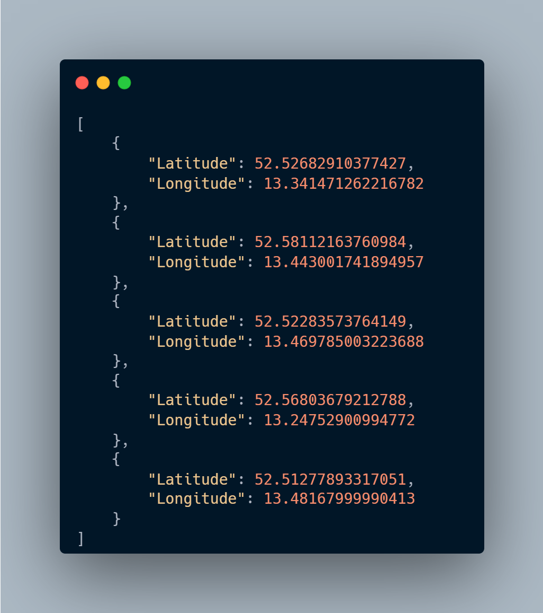
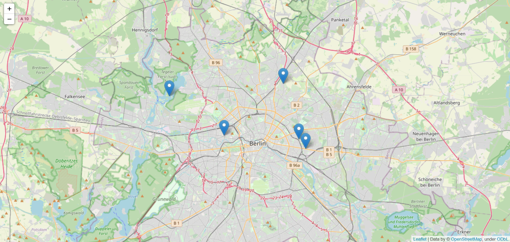

<!-- PROJECT SHIELDS -->
<!--
*** I'm using markdown "reference style" links for readability.
*** Reference links are enclosed in brackets [ ] instead of parentheses ( ).
*** See the bottom of this document for the declaration of the reference variables
*** for contributors-url, forks-url, etc. This is an optional, concise syntax you may use.
*** https://www.markdownguide.org/basic-syntax/#reference-style-links
-->


<!-- PROJECT LOGO -->
<br />
<p align="center">
  <a href="https://github.com/hugodscarvalho/rancoord">
    
  </a>
  <h3 align="center">RanCoord</h3>
  <p align="center">
    RanCoord is a Python package for random sampling of geographic coordinates!
    <br />
    <a href="https://github.com/hugodscarvalho/rancoord"><strong>Explore the docs »</strong></a>
    <br />
    <br />
    <a href="https://github.com/hugodscarvalho/rancoord">View Demo</a>
    ·
    <a href="https://github.com/hugodscarvalho/rancoord/issues">Report Bug</a>
    ·
    <a href="https://github.com/hugodscarvalho/rancoord/issues">Request Feature</a>
  </p>
</p>


<!-- TABLE OF CONTENTS -->
<details open="open">
  <summary>Table of Contents</summary>
  <ol>
    <li>
      <a href="#about-the-project">About The Project</a>
      <ul>
        <li><a href="#built-with">Built With</a></li>
      </ul>
    </li>
    <li>
      <a href="#getting-started">Getting Started</a>
      <ul>
        <li><a href="#prerequisites">Prerequisites</a></li>
        <li><a href="#installation">Installation</a></li>
      </ul>
    </li>
    <li><a href="#usage">Usage</a></li>
    <li><a href="#roadmap">Roadmap</a></li>
    <li><a href="#contributing">Contributing</a></li>
    <li><a href="#license">License</a></li>
    <li><a href="#contact">Contact</a></li>
    <li><a href="#acknowledgements">Acknowledgements</a></li>
  </ol>
</details>


<!-- ABOUT THE PROJECT -->
## About The Project

<a href="https://github.com/hugodscarvalho/rancoord">
    
</a>

This project arises within the scope of research and development activities in the area of freight transport with respect to vehicle routing problems. Geographic coordinates are one of the most accurate means of identifying a location with extreme sensitivity.

Thus, with this project it is intended:
* Reduce the time and effort required to acquire geographic coordinates within a specific location
* Eliminate the need to use geographic data that do not fit a particular problem to be addressed
* Provide geographic coordinates in an extremely easy, fast and customized way to the user's needs

As time goes on, according to my availability and the feedback offered by users it is expected that new features will be included in this package that can make life easier for users addressing vehicle routing problems associated with geographic coordinates.
A list of commonly used resources that I find helpful are listed in the acknowledgements.

### Built With

The major frameworks used to build this project were:
* [Python](https://www.python.org/)
* [Folium](https://github.com/python-visualization/folium)
* [Project OSRM](http://project-osrm.org/)


<!-- GETTING STARTED -->
## Getting Started

This section presents how the package can be reached and installed.

### Where to get it

The source code is currently hosted on GitHub at: https://github.com/hugodscarvalho/rancoord

Binary installer for the latest released version are available at the Python Package Index (PyPI).

```sh
pip install rancoord
```

<!-- USAGE EXAMPLES -->
## Usage

### 1. Import the package
The first step in using the package is, after it has been installed, to import it.

```python
import rancoord as rc
```

### 2. Geographical polygon 

In order to be able to generate a number of random geographic coordinates within a specific location it is necessary to create the polygon that encompasses it. The package provides three different ways to approach this prerequisite.

#### 2.1. Use the default polygon
If you choose this option, there's no need to define it, the geographic randomizer module will already have it defined. Geographic data comprised in it:

```python
poly = Polygon(
    [
        (38.78562804689748, -9.47276949903965),
        (38.713870245772654, -9.139059782242775),
        (38.89740476139506, -9.055975675797463),
        (38.96871087768789, -8.969115019059181),
        (39.05061092686942, -8.92894625685215),
        (39.08579612091302, -9.407538175797463),
        (38.984457987516386, -9.397238493180275),
    ]
)
```
Map visualization:

<a href="https://github.com/hugodscarvalho/rancoord">
    
</a>

#### 2.2. Create your own polygon
If you choose this option, you will have to define the polygon using some geographic tool as the app from [Headwall Photonics](http://apps.headwallphotonics.com/), copy the coordinates, structure them and define de polygon.

<a href="https://github.com/hugodscarvalho/rancoord">
    
</a>

#### 2.3. Get a polygon using an address using 
If you choose this option, you can get a polygon based on the [bounding box](https://en.wikipedia.org/wiki/Minimum_bounding_box) of an address or location using *Noninatim*. 
```python
# Get the bounding box
bounding_box = nominatim_geocoder('Braga, Portugal')
# Create a polygon based on the previously created bounding box
poly = polygon_from_boundingbox(bounding_box)
```

### 3. Randomize the geographic coordinates
Once the geographic polygon has been defined, the next step is to generate the geographic coordinates. You can also choose to modify the number of locations to generate within the polygon (*default is **10***). In addition, although by default these options are disabled, you can choose to save the geographic coordinates and to save a map containing them (*options explained below*).

```python
lat, lon = coordinates_randomizer(polygon = poly, num_locations = 50, plot = True, save = True)
```

This method will return two lists, one with the latitudes and one with the longitudes with the following characteristics:
1. Locations within the previously defined polygon
2. 50 locations
3. A plot will be saved in the `/maps` folder with the .html format and named by default `map_DDMMYYYY_HHMMSS` with the temporal information of locations generation.
4. A file containing the locations will be saved in the `/coordinates` folder with the default `.json` format and named by default `coordinates_DDMMYYYY_HHMMSS` with the temporal information of locations generation.

### 4. [EXTRA] Auxiliar methods
The following methods were used in the development of this random geocraphic coordinates generation.

* [`create_dir`](#create_dir)
* [`nominatim_geocoder`](#nominatim_geocoder)
* [`polygon_from_boundingbox`](#polygon_from_boundingbox)
* [`list_average`](#list_average)
* [`plot_coordinates`](#plot_coordinates)
* [`multiple_formats_saver`](#multiple_formats_saver)
* [`haversine_distance`](#haversine_distance)
* [`vincenty_distance`](#vincenty_distance)
* [`osrm_distance`](#osrm_distance)
* [`distance_matrix`](#distance_matrix)


<a name="create_dir"/>

#### create_dir( dir_name )

Auxiliar function to create **a new directory** if it doesn't already exists. User can choose to name the specific location.

___Arguments___
* `dir_name` [String] : Address the new name. **Defaults** to *'data'*.                                                                                        

___Example___

```python
dir_name = 'example'

create_dir(dir_name)
```

-------------------------------------------

<a name="nominatim_geocoder"/>

#### nominatim_geocoder(address)

Function to geocode an address using the Nominatim geocoder and return the bounding box of the address.

___Arguments___
* `address` [String] :  Address to geocode.

___Raises___
* `ValueError` **(address)**: The introduced adress was not found. Please introduce a valid address.

___Returns___
* [List] : List of coordinates of the bounding box of the address.

___Example___

```python

bounding_box = nominatim_geocoder(address = 'Barcelona, Spain')

```

-------------------------------------------

<a name="polygon_from_boundingbox"/>

#### polygon_from_boundingbox(boundingbox)

Function to create a polygon from a bounding box.

___Arguments___
* `boundingbox` [List] : List of coordinates of the bounding box.

___Returns___
* [Polygon] : Polygon created from the bounding box.

___Example___

```python

poly = polygon_from_boundingbox(boundingbox = bounding_box)

```

-------------------------------------------

<a name="list_average"/>

#### list_average(list_of_numbers)

Function to calculate the average of a list of numbers in order to center geographical map.

___Arguments___
* `list_of_numbers` [List] : List of numbers.

___Returns___
* [float] : Average of the list of numbers.

___Example___

```python

avg = list_average(list_of_numbers = [1, 2, 2, 3, 6, 7])

```

-------------------------------------------

<a name="plot_coordinates"/>

#### plot_coordinates(list_of_numbers)

Function to calculate the average of a list of numbers in order to center geographical map.

___Arguments___
* `lat` [List] : List of numbers.
* `lon` [List] : List of numbers.
* `zoom` [Integer] :  Zoom level of the map. Defaults to 11.
* `save`[Boolean] : If True, the map will be saved. Defaults to True.


___Returns___
* [Folium Map] : Folium map with the coordinates.

___Example___

```python

map = plot_coordinates(lat = lat, lon = lon, zoom = 11, save = True)

```

-------------------------------------------

<a name="multiple_formats_saver"/>

#### multiple_formats_saver(lat, lon, columns, file_format, file_name, dir_name)

This function saves the coordinates lat and lon as the names introduced
in a given columns list ('Latitude' and 'Longitude' by default). The
coordinates are saved in a given format introduced by the user among the
possibilities csv, json, txt and xlsx (json by default) and the output
file name is also given by the user as file_name. User can choose the
directory name where the output file will be saved.

___Arguments___
* `lat` [List] : List of latitude values.
* `lon` [List] : List of longitude values.
* `columns` [Integer] :  Column names. Defaults to ['Latitude', 'Longitude'].
* `file_format`[String] : File format. Defaults to 'json'.
* `file_name`[String] : File name. Defaults to 'coordinates'.
* `dir_name`[String] : Directory name. Defaults to 'coordinates'.

___Raises___
* `AssertionError` **(lat)**: No values found on the latitude list.
* `AssertionError` **(lon)**: No values found on the longitude list.
* `AssertionError` **(lat & lon)**: The lists must have the same length.
* `AssertionError` **(columns)**: No column names found.
* `AssertionError` **(columns)**: The column names list must have two elements. 
* `AssertionError` **(file_name)**: No file name found.
* `AssertionError` **(dir_name)**: No directory name found.

___Returns___
* [None] : None.

___Example___

```python

multiple_formats_saver(lat = lat, lon = lon, columns = ['Latitude', 'Longitude'], file_format = 'json', file_name = 'coordinates', dir_name = 'coordinates')

```

-------------------------------------------

<a name="haversine_distance"/>

#### haversine_distance(pickup_lat, pickup_long, dropoff_lat, dropoff_long, miles)

The haversine formula is used to calculate the great-circle distance between two points on a sphere given their longitudes and latitudes.

___Arguments___
* `pickup_lat` [float] : The latitude of the pickup location.
* `pickup_long` [float] : The longitude of the pickup location.
* `dropoff_lat` [float] :  The latitude of the dropoff location.
* `dropoff_long` [float] :  The longitude of the dropoff location.
* `miles`[Boolean] : If True, the output will be in miles. If False, the output will be in kilometers. Defaults to False.


___Returns___
* [float] : The distance between two points on a sphere.

___Example___

```python

haversine = haversine_distance(lat = 41.478, lon = -8.1992, miles = False)

```

-------------------------------------------

#### vincenty_distance(pickup_lat, pickup_long, dropoff_lat, dropoff_long, miles)

The function takes the latitude and longitude of two points on the Earth's surface and returns the distance between them in kilometers using the Vincenty's formula.

___Arguments___
* `pickup_lat` [float] : The latitude of the pickup location.
* `pickup_long` [float] : The longitude of the pickup location.
* `dropoff_lat` [float] :  The latitude of the dropoff location.
* `dropoff_long` [float] :  The longitude of the dropoff location.
* `miles`[Boolean] : If True, the output will be in miles. If False, the output will be in kilometers. Defaults to False.


___Returns___
* [float] : The distance between two points on the earth using the vincenty's formula.

___Example___

```python

vincenty = vincenty_distance(lat = 41.478, lon = -8.1992, miles = False)

```

-------------------------------------------

#### osrm_distance(pickup_lat, pickup_long, dropoff_lat, dropoff_long, miles)

This function takes in the pickup and dropoff coordinates and returns the distance between them in kilometers by default using the OSRM API.

___Arguments___
* `pickup_lat` [float] : The latitude of the pickup location.
* `pickup_long` [float] : The longitude of the pickup location.
* `dropoff_lat` [float] :  The latitude of the dropoff location.
* `dropoff_long` [float] :  The longitude of the dropoff location.
* `miles`[Boolean] : If True, the output will be in miles. If False, the output will be in kilometers. Defaults to False.


___Returns___
* [float] : The distance between two coordinates.

___Example___

```python

osrm = osrm_distance(lat = 41.478, lon = -8.1992, miles = False)

```

-------------------------------------------

#### distance_matrix(lat, lon, method)

For each pair of geographic coordinates, calculate the distance between them using the specified method and return a matrix of distances.

___Arguments___
* `lat` [List] :  List of latitudes.
* `lon` [List] : List of longitudes.
* `method` [String] :  The method to use to calculate the distances. 'haversine', 'vincenty' or 'osrm'. Vincenty's distance by default.

___Returns___
* [numpy.ndarray] : A matrix of distances between each pair of coordinates.

___Example___

```python

haversine = haversine_distance(lat = lat, lon = lon, method = 'osrm')

```

-------------------------------------------

### 5. [EXTENDED] Full code usage
The following examples show an extended full code usage of the package.

<a href="https://github.com/hugodscarvalho/rancoord">
    
</a>

Random coordinates:

<p align="center">
<a href="https://github.com/hugodscarvalho/rancoord">
    
</a>
</p>

Distance matrix:

<p align="center">
<a href="https://github.com/hugodscarvalho/rancoord">
     
</a>
</p>

Map visualization:

<p align="center">
<a href="https://github.com/hugodscarvalho/rancoord">
    
</a>
</p>


<!-- ROADMAP -->
## Roadmap

See the [open issues](https://github.com/hugodscarvalho/rancoord/issues) for a list of proposed features (and known issues).


<!-- CONTRIBUTING -->
## Contributing

Contributions are what make the open source community such an amazing place to be learn, inspire, and create. Any contributions you make are **greatly appreciated**.

1. Fork the Project
2. Create your Feature Branch (`git checkout -b feature/AmazingFeature`)
3. Commit your Changes (`git commit -m 'Add some AmazingFeature'`)
4. Push to the Branch (`git push origin feature/AmazingFeature`)
5. Open a Pull Request


<!-- LICENSE -->
## License

Distributed under the MIT License. See `LICENSE` for more information.


<!-- CONTACT -->
## Contact

Project Link: [Github](https://github.com/hugodscarvalho/rancoord)
Linkedin: [hugodscarvalho](https://www.linkedin.com/in/hugodscarvalho)


<!-- ACKNOWLEDGEMENTS -->
## Acknowledgements
* [Folium](https://github.com/python-visualization/folium)
* [Project OSRM](http://project-osrm.org/)
* [Geopy](https://github.com/geopy/geopy)


<!-- MARKDOWN LINKS & IMAGES -->
<!-- https://www.markdownguide.org/basic-syntax/#reference-style-links -->
[license-url]: https://github.com/hugodscarvalho/rancoord/blob/main/LICENSE
[linkedin-url]: https://linkedin.com/in/hugodscarvalho
[product-screenshot]: images/rancoord_logo.png
